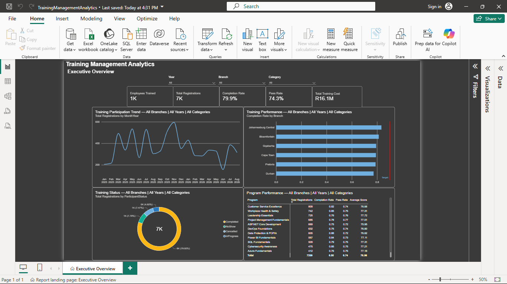
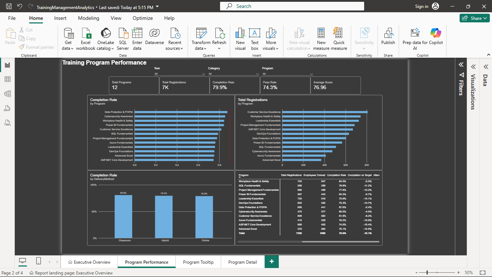

# Training Management Analytics — Power BI

## Overview

**Training Management Analytics** is a Power BI portfolio project built around data generated by a Training Management System (TMS).

The solution transforms employee, training program, training event, participation, assessment, attendance, and cost data into an interactive analytics experience for executives, training administrators, and branch managers.

The project demonstrates an end-to-end BI workflow including **data preparation, dimensional modelling, DAX, time intelligence, data validation, Row-Level Security, performance optimization, and Power BI Service deployment**.

---

## Business Problem

A Training Management System can capture large amounts of operational data, but raw records do not easily answer management questions such as:

- How many employees are participating in training?
- Which branches have the highest and lowest completion rates?
- Which programs experience high no-show or pending rates?
- Are training outcomes improving year over year?
- How much is being invested in training?
- What is the cost per completed registration?
- Which programs or branches require further investigation?
- Are managers only able to access employee data for branches they manage?

This Power BI solution was designed to turn TMS operational data into decision-support analytics.

---

## Business Objectives

The report supports analysis across five main areas:

### Participation

Monitor:

- Total registrations
- Employees trained
- Registration trends
- Participation by branch
- Participation by program
- Event participation

### Training Outcomes

Analyze:

- Completion rate
- Finalized completion rate
- Pending training
- Pass rate
- Average assessment score
- Training hours

### Attendance

Monitor:

- Attendance rate
- No-show rate
- No-show trends
- Training cost associated with no-show registrations

### Training Investment

Analyze:

- Total training cost
- Cost per employee
- Cost per registration
- Cost per completion
- Cost per training hour
- Program cost share
- Training investment trends

### Operational Performance

Evaluate:

- Event capacity utilization
- Hosting branch activity
- Employee home-branch performance
- Program performance
- Event-level exceptions

---

## Technology Stack

| Technology | Purpose |
|---|---|
| Power BI Desktop | Report development and semantic modelling |
| Power Query | Data extraction, cleaning and transformation |
| DAX | Measures, KPIs and analytical calculations |
| Power BI Service | Report deployment, refresh and distribution |
| SQL / TMS Data | Analytical data source |
| ASP.NET Core TMS | Source application context |

---

## Data Model

The project uses a **star-schema-style dimensional model**.

```text
                         DimDate
                            │
                            │
                            ▼
DimEmployee ──────────► FactTraining ◄────────── DimProgram
     │                      │
     │                      │
DimBranch                    └────────────── DimHostBranch
```

### FactTraining

The central fact table represents employee participation in training events.

The approximate grain is:

> One employee registration/participation record for one training event.

It contains information such as:

- Registration
- Participant status
- Attendance
- Assessment results
- Completion
- Training hours
- Training cost
- Event dates
- Employee
- Program
- Branch

### Dimensions

The semantic model contains dimensions for:

- Employee
- Training Program
- Employee Home Branch
- Event Hosting Branch
- Date

Home branch and hosting branch are deliberately treated as separate analytical concepts.

**Employee Home Branch** represents organizational responsibility for an employee.

**Hosting Branch** represents the location responsible for hosting a training event.

For example, a Durban employee attending an event hosted in Johannesburg remains part of Durban's employee-performance analysis while contributing to Johannesburg's hosting activity.

---

## Date Model

The model supports multiple date perspectives:

```text
EventStartDate
RegistrationDate
CompletionDate
```

`EventStartDate` is used as the primary active date relationship.

Inactive relationships are activated through DAX when analysis needs to use registration or completion dates.

Example:

```DAX
Completions by Completion Date =
CALCULATE(
    [Completed Training],
    USERELATIONSHIP(
        DimDate[Date],
        FactTraining[CompletionDate]
    )
)
```

This allows the report to distinguish between:

- When an event occurred
- When an employee registered
- When training was actually completed

---

## Core DAX Measures

### Participation

```DAX
Total Registrations =
COUNTROWS(FactTraining)
```

```DAX
Employees Trained =
DISTINCTCOUNT(FactTraining[EmployeeId])
```

### Completion

```DAX
Completion Rate =
DIVIDE(
    [Completed Training],
    [Total Registrations],
    0
)
```

A separate finalized completion measure excludes registrations that are still pending/in progress.

This distinction prevents unfinished training from being treated as a finalized unsuccessful outcome.

### Assessment

```DAX
Pass Rate =
DIVIDE(
    [Passed Training],
    [Assessed Training],
    0
)
```

Employees who were not assessed, such as valid no-show records, are not incorrectly treated as having scored zero.

### Cost

```DAX
Cost per Completion =
DIVIDE(
    [Total Training Cost],
    [Completed Training],
    0
)
```

```DAX
Cost per Registration =
DIVIDE(
    [Total Training Cost],
    [Total Registrations],
    0
)
```

### No-Show Cost

```DAX
No-Show Cost =
CALCULATE(
    [Total Training Cost],
    FactTraining[ParticipantStatus] = "NoShow"
)
```

This represents training expenditure associated with no-show registrations and is intentionally not labelled as "wasted cost," because the data does not establish that all such expenditure was avoidable or recoverable.

---

## Time Intelligence

The report includes year-over-year and year-to-date analysis.

Examples include:

- Registrations YTD
- Previous-year registrations
- Registration YoY %
- Previous-year completion rate
- Completion-rate YoY change
- Previous-year pass rate
- No-show YoY change
- Training-cost YoY change
- Rolling completion trends

Example:

```DAX
Completion Rate Previous Year =
CALCULATE(
    [Completion Rate],
    SAMEPERIODLASTYEAR(DimDate[Date])
)
```

This enables analysis such as:

```text
Completion Rate
82.4%

+4.2 percentage points vs previous year
```

---

## Advanced DAX

The project demonstrates filter-context manipulation using:

- `CALCULATE()`
- `REMOVEFILTERS()`
- `ALL()`
- `ALLSELECTED()`
- `RANKX()`
- `USERELATIONSHIP()`
- `DATESYTD()`
- `SAMEPERIODLASTYEAR()`
- `DATESINPERIOD()`

For example:

```DAX
Organization Registrations =
CALCULATE(
    [Total Registrations],
    REMOVEFILTERS(DimBranch)
)
```

This allows branch activity to be compared with organization-wide activity while retaining other filters such as year or program.

---

## Report Pages

### 1. Executive Overview

Provides organization-level monitoring of:

- Employees trained
- Registrations
- Completion rate
- Attendance
- Pass rate
- No-show rate
- Training cost
- Performance trends



### 2. Program Performance

Analyzes:

- Registrations by program
- Completion by program
- Pass rate
- Attendance
- Program ranking
- Program contribution to total training activity



### 3. Employee Analysis

Supports analysis of:

- Employee training participation
- Completion history
- Assessment outcomes
- Training hours
- Employee home branch

### 4. Branch Performance

Compares employee training outcomes across organizational branches using the employee's **home branch**.

### 5. Training Operations

Focuses on event delivery, including:

- Hosting branch
- Event participation
- Capacity
- Utilization
- Attendance
- Operational exceptions

### 6. Trend Analysis

Provides:

- Monthly trends
- Year-over-year comparisons
- YTD metrics
- Completion trends
- Registration trends
- No-show trends
- Rolling averages

### 7. Training Investment

Analyzes:

- Total training expenditure
- Cost per registration
- Cost per employee
- Cost per completion
- Cost per training hour
- Program investment
- Branch investment
- Cost versus completion

---

## Drill-Through Pages

The report includes supporting drill-through pages for:

```text
Program → Program Detail

Employee → Employee Detail

Branch → Branch Detail

Event → Event Detail
```

This allows users to move from high-level monitoring to detailed investigation without overcrowding the primary report pages.

---

## Report UX

The report is designed to behave more like an analytical application than a collection of disconnected dashboards.

UX features include:

- Page navigation
- Consistent page layouts
- Synced slicers
- Filter panels
- Reset-filter controls
- Bookmarks
- Report-page tooltips
- Drill-through navigation
- Back buttons
- Intentional visual interactions
- Metric definitions
- Mobile layout considerations

The report follows an analytical hierarchy:

```text
Executive Monitoring
        ↓
Identify Exception
        ↓
Branch / Program Analysis
        ↓
Detailed Investigation
```

---

## Row-Level Security

Dynamic Row-Level Security is used to restrict branch-level employee information.

The security model is based primarily on **employee home branch**, rather than the location where training was hosted.

Conceptually:

```text
Logged-in User
      ↓
USERPRINCIPALNAME()
      ↓
UserBranchAccess
      ↓
Authorized Branch
      ↓
Employee Training Data
```

This supports scenarios such as:

```text
Durban Manager
→ Durban employees

Johannesburg Manager
→ Johannesburg employees

Authorized Executive / Training Admin
→ Organization-wide reporting
```

A hosting branch does not automatically gain access to an employee's detailed training information merely because the employee attended an event at that branch.

---

## Data Quality

The project includes explicit data-quality and validation rules.

Checks include:

- Duplicate registrations
- Invalid scores
- Invalid date sequences
- Missing foreign keys
- Status conflicts
- Missing completion dates
- Event-capacity exceptions
- Invalid training costs
- Home branch vs hosting branch validation

An important principle used throughout the project is:

> Unusual data is not automatically incorrect data.

For example:

```text
ParticipantStatus = NoShow
AttendanceStatus  = Absent
Score             = blank
Result            = NotAssessed
```

is a valid combination.

A blank assessment score represents **not assessed**, rather than a score of zero.

---

## Source Reconciliation

Power BI metrics are validated against source-system totals at multiple levels:

```text
Organization
      ↓
Year
      ↓
Branch
      ↓
Program
      ↓
Participant Status
```

Example reconciliation:

| Metric | TMS | Power BI | Difference |
|---|---:|---:|---:|
| Registrations | 4,200 | 4,200 | 0 |
| Completed | 3,444 | 3,444 | 0 |
| No Shows | 336 | 336 | 0 |
| Training Cost | R5.0M | R5.0M | R0 |

This helps ensure transformations and DAX definitions remain consistent with the source-system business rules.

---

## Performance Optimization

Performance considerations include:

- Star-schema modelling
- Removal of unnecessary source columns
- Appropriate data types
- Reduction of unnecessary high-cardinality fields
- Measures instead of unnecessary calculated columns
- Query folding where supported
- Source-side filtering
- Reduced visual complexity
- Controlled visual interactions
- Performance Analyzer
- Incremental-refresh considerations for large historical datasets

The optimization strategy follows:

```text
Measure
   ↓
Identify bottleneck
   ↓
Optimize appropriate layer
   ↓
Re-test
```

rather than blindly rewriting DAX.

---

## Power BI Service Deployment

The solution is designed for deployment through Power BI Service.

```text
Power BI Desktop
       ↓
Publish
       ↓
Workspace
       ↓
Semantic Model
       ↓
Report
       ↓
RLS / Refresh
       ↓
Power BI App
       ↓
Report Consumers
```

Deployment considerations include:

- Dedicated workspace
- Semantic-model configuration
- Data-source credentials
- Scheduled refresh
- On-premises data gateway where required
- Refresh monitoring
- RLS role assignment
- Audience-based distribution
- Power BI App publishing
- Development/Test/Production separation

---

## Analytical Storytelling

The report follows the analytical framework:

```text
WHAT?
What changed?

     ↓

WHERE?
Where is the change concentrated?

     ↓

WHY?
What related evidence might explain it?

     ↓

NEXT?
What should management investigate?
```

This prevents the report from becoming a collection of disconnected KPIs.

For example, rather than only reporting a low completion rate, the analysis can investigate whether the issue is concentrated by:

- Branch
- Program
- Attendance
- No-shows
- Pending registrations
- Assessment performance
- Training cost

The report deliberately distinguishes **association from causation** and avoids making conclusions that the available data cannot support.

---

## Example Business Insight

A typical analytical finding might be:

> Training participation increased substantially year over year while completion improved and no-shows declined. However, branch-level analysis revealed that one branch moved against the organization-wide trend. Program-level investigation showed that the issue was concentrated in a specific training program with high no-show and pending rates, despite strong pass rates among assessed participants. This indicates that scheduling, attendance and participant progression should be investigated before changes are made to assessment content.

---

## Key Skills Demonstrated

This project demonstrates practical experience with:

**Data preparation**
- Power Query
- Data cleaning
- Data types
- Business-rule validation
- Query folding

**Data modelling**
- Star schema
- Fact and dimension tables
- Role-playing dimensions
- Relationships
- Date dimensions

**DAX**
- Measures
- Filter context
- `CALCULATE`
- Time intelligence
- Ranking
- Dynamic comparisons
- Percentage-of-total analysis

**Analytics**
- Participation analysis
- Completion analysis
- Attendance analysis
- Program analysis
- Branch analysis
- Cost analysis
- Trend analysis

**Security**
- Row-Level Security
- Dynamic user-to-branch access
- Employee-data authorization

**Deployment**
- Power BI Service
- Workspaces
- Semantic models
- Scheduled refresh
- Gateway concepts
- Power BI Apps

**Quality & Performance**
- Source reconciliation
- Data-quality checks
- Performance Analyzer
- Model optimization

---

## Future Enhancements

Potential future enhancements include:

- Connecting directly to the production TMS SQL database
- Automated refresh
- Incremental refresh
- Microsoft Fabric integration
- Training-budget analysis
- Training-provider analysis
- Employee skills and competency tracking
- Certification-expiry monitoring
- Predictive no-show analysis
- Training demand forecasting
- Training ROI analysis using measurable business outcomes

True ROI analysis would require connecting training data to business outcomes such as productivity, sales, incidents, employee performance, compliance or retention.

---

## End-to-End Portfolio Context

This analytics project forms part of a broader Training Management Platform:

```text
Angular LMS
     ↓
ASP.NET Core REST API
     ↓
SQL Database
     ↓
Power BI Analytics
     ↓
Power BI Service
```

The overall portfolio demonstrates how an operational application can generate structured business data that is subsequently transformed into governed analytics and management insights.

---

## Project Status

**Portfolio Project — Training Management Analytics**

Core implementation covers:

- Data preparation
- Dimensional modelling
- DAX
- Time intelligence
- Branch and program analytics
- Training investment analysis
- RLS
- Data quality
- Performance optimization
- Power BI Service deployment concepts
- Executive analytical storytelling

---

## Author

**Puleng**

Software Developer | ASP.NET Core | Angular | Azure | Power BI